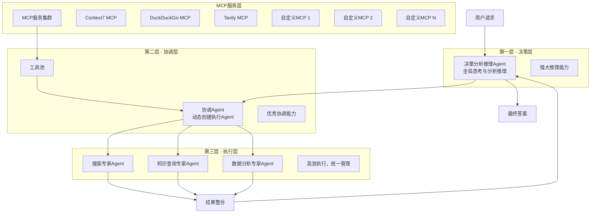

# LangGraph MCP Agent


**LangGraph MCP Agent** 是一个基于 [LangGraph](https://github.com/langchain-ai/langgraph) 构建的、先进的多层 Agent 架构系统。它采用**决策、协调、专家**三层结构，旨在高效、智能地处理复杂任务。

该系统通过集成**多能力平台 (MCP)**，赋予了 Agent 调用外部工具和服务的能力，极大地扩展了其应用场景。无论是进行数据分析、调用专用 API，还是执行复杂的计算任务，LangGraph MCP Agent 都能游刃有余。

## 核心功能

- **三层 Agent 架构**:
  - **决策 Agent**: 负责理解用户意图、分析任务并制定详细的执行计划。
  - **协调 Agent**: 根据计划动态创建专家 Agent 团队，并分配合适的工具。
  - **专家 Agent**: 执行具体的子任务，可调用 MCP 工具完成专业工作。
- **动态工具调用**: 无缝集成 MCP，使 Agent 能够调用任何已注册的外部工具或服务。
- **可插拔 LLM**: 轻松替换不同层级的语言模型，以适应不同的性能和成本需求。
- **异步执行**: 基于 `asyncio` 构建，支持高并发的任务处理。
- **双重接口**: 提供功能丰富的 `CLI` 命令行工具和标准的 `FastAPI` 服务接口。
- **状态化执行流**: 利用 `LangGraph` 管理复杂的任务状态，确保执行过程的稳定性和可追溯性。

## 架构设计

本系统采用分层架构，将复杂任务的生命周期分解为规划、协调、执行和整合四个阶段，由不同职责的 Agent 协同完成。



- **决策层 (Decision Agent)**: 作为系统的“大脑”，它首先接收用户请求，进行深度分析，评估任务的复杂度，并生成一个结构化的、包含多个子任务的执行计划。在所有专家完成工作后，它还负责整合结果，生成最终的、连贯的答案。
- **协调层 (Coordination Agent)**: 作为“项目经理”，它接收决策层制定的计划，动态地创建一组“专家 Agent”，并根据每个子任务的需求，从 MCP 工具池中为其分配合适的工具。
- **专家层 (Expert Agent)**: 作为“执行者”，每个专家 Agent 负责一个具体的子任务。如果任务需要，它会使用分配到的 MCP 工具来完成，并将结果返回。

## 安装与部署

我们提供两种部署方式：**本地直接运行**和 **Docker 容器化部署**。

### 方式一：本地直接运行

#### 1. 环境准备

- **Python**: 确保您的环境中已安装 Python 3.11 或更高版本。
- **uv**: 本项目推荐使用 `uv` 作为包管理工具。
  ```bash
  # 如果您尚未安装 uv
  pip install uv
  ```

#### 2. 克隆项目并安装依赖

```bash
git clone https://github.com/your-username/langgraph-mcp-agent.git
cd langgraph-mcp-agent

# 创建并激活虚拟环境
uv venv
source .venv/bin/activate  # macOS/Linux
# .venv\Scripts\activate  # Windows

# 安装依赖
uv pip install -e .
```

#### 3. 配置环境

本项目通过环境变量进行配置。

```bash
# 复制模板文件
cp .env.example .env
```
然后，编辑 `.env` 文件，至少填入您的 `NEWAPI_KEY`。

### 方式二：使用 Docker 部署 (推荐)

使用 Docker 是最简单、最推荐的部署方式。

#### 1. 环境准备
- **Docker**: 确保已安装 Docker 和 Docker Compose。

#### 2. 配置环境
与本地部署一样，您需要先创建并配置 `.env` 文件。
```bash
cp .env.example .env
```
编辑 `.env` 文件，填入您的 `NEWAPI_KEY`。Docker Compose 会自动加载此文件。

#### 3. 启动服务
在项目根目录下，执行以下命令：
```bash
docker-compose up --build -d
```
服务将在后台启动，并可以通过 `http://localhost:8001` 访问 (端口映射在 `docker-compose.yml` 中定义)。

## 配置指南

所有配置都通过根目录下的 `.env` 文件进行管理，确保了密钥等敏感信息的安全。

### `.env` 文件详解

您需要根据 `.env.example` 模板创建自己的 `.env` 文件。以下是各项配置的说明：

```dotenv
# .env 文件示例

# ==============================================================================
#  API Keys & Endpoints (必须配置)
# ==============================================================================

# NewAPI 或其他兼容OpenAI的服务的凭证
# 这是最关键的配置，必须提供，否则应用将无法启动
NEWAPI_KEY="sk-your-newapi-key-here"

# API服务的Base URL
# 如果您使用自建服务或特定地区的端点，请修改此项
NEWAPI_BASE_URL="https://newapi.thefool.chat/v1"


# ==============================================================================
#  模型选择 (可选配置)
# ==============================================================================
# 您可以为不同层级的Agent指定不同的模型
# 如果留空，将使用代码中定义的默认值

# 决策层模型 (需要最强的推理能力)
DECISION_AGENT_MODEL="gemini-2.5-pro-nothinking-VCAI"

# 协调层模型 (需要优秀的理解和协调能力)
COORDINATION_AGENT_MODEL="gemini-2.5-pro-nothinking-VCAI"

# 默认专家模型 (当无法根据任务类型匹配到特定模型时使用)
DEFAULT_EXPERT_MODEL="glm-4.5"


# ==============================================================================
#  其他配置 (可选配置)
# ==============================================================================

# 日志级别 (DEBUG, INFO, WARNING, ERROR)
LOG_LEVEL="INFO"
```

### 配置是如何工作的？

系统启动时，[`src/langgraph_mcp_agent/config/settings.py`](src/langgraph_mcp_agent/config/settings.py:1) 会自动读取 `.env` 文件中的所有环境变量，并用它们来动态构建配置。

您**不再需要**修改任何 Python 代码来更换模型或 API 密钥。

```python
# src/langgraph_mcp_agent/config/settings.py (核心逻辑简化)

class Settings:
    """全局配置管理器，完全基于环境变量"""

    def __init__(self):
        # API凭证 (如果 NEWAPI_KEY 未设置，则会引发 ValueError)
        self.NEWAPI_KEY = os.getenv("NEWAPI_KEY")
        if not self.NEWAPI_KEY:
            raise ValueError("错误: 环境变量 `NEWAPI_KEY` 未设置。")
            
        self.NEWAPI_BASE_URL = os.getenv("NEWAPI_BASE_URL", "...")

        # 从环境变量加载模型选择
        self.DECISION_AGENT_MODEL = os.getenv("DECISION_AGENT_MODEL", "...")
        self.COORDINATION_AGENT_MODEL = os.getenv("COORDINATION_AGENT_MODEL", "...")

        # 动态构建模型映射
        self.MODEL_MAPPINGS = self._create_model_mappings()
        self.EXPERT_MODELS = self._create_expert_models()

    def _create_model_mappings(self) -> Dict[str, Any]:
        """动态创建基础Agent的模型映射"""
        return {
            "decision_agent": {
                "model_name": self.DECISION_AGENT_MODEL, # 使用环境变量
                "api_key": self.NEWAPI_KEY,           # 使用环境变量
                # ...
            },
            # ...
        }

# 在程序启动时创建全局唯一的配置实例
settings = Settings()
```

这种设计使得配置管理极其灵活和安全，您可以为不同的开发、测试和生产环境维护不同的 `.env` 文件。

## 使用方法

### 1. 启动 FastAPI 服务器

启动 API 服务是与系统交互的主要方式。`CLI` 工具也是通过调用此服务来工作的。

```bash
python -m langgraph_mcp_agent.cli server
```

服务启动后，您将在终端看到以下输出：

```
[bold green]启动服务器...[/bold green]
主机: 0.0.0.0
端口: 8000
自动重载: 否
INFO:     Started server process [12345]
INFO:     Waiting for application startup.
INFO:     Application startup complete.
INFO:     Uvicorn running on http://0.0.0.0:8000 (Press CTRL+C to quit)
```

### 2. 使用 CLI 工具

`CLI` 提供了丰富的功能来与 Agent 系统交互。

**查看系统状态**

```bash
python -m langgraph_mcp_agent.cli status
```

**执行查询**

```bash
python -m langgraph_mcp_agent.cli query "分析一下最近人工智能领域，特别是多模态模型的发展趋势。"
```

**进入交互模式**

为了获得更好的体验，可以进入交互模式，在这里您可以连续提问。

```bash
python -m langgraph_mcp_agent.cli interactive
```

在交互模式下，您可以输入 `help` 查看所有可用命令。

## API 文档

当 FastAPI 服务器运行时，您可以直接在浏览器中访问自动生成的 API 文档：

- **Swagger UI**: [http://localhost:8000/docs](http://localhost:8000/docs)
- **ReDoc**: [http://localhost:8000/redoc](http://localhost:8000/redoc)

通过这些界面，您可以方便地浏览所有 API 端点、请求参数和响应模型，并直接进行 API 调用测试。

## 贡献

我们欢迎任何形式的贡献！如果您有好的想法或发现了 Bug，请随时提交 Pull Request 或创建 Issue。